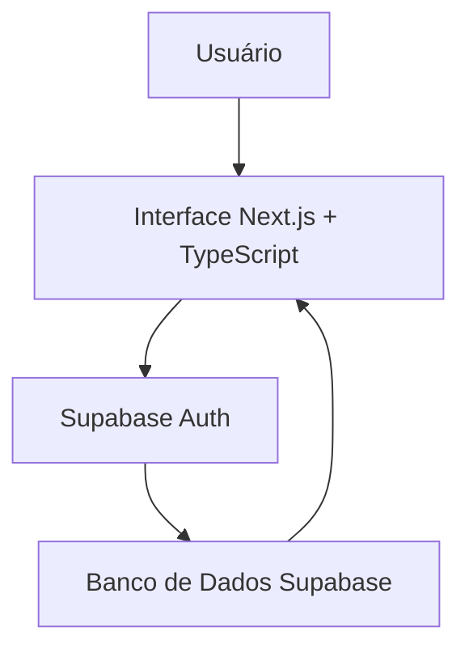
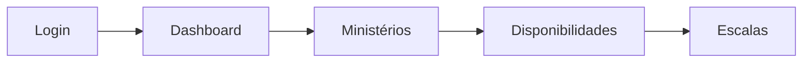
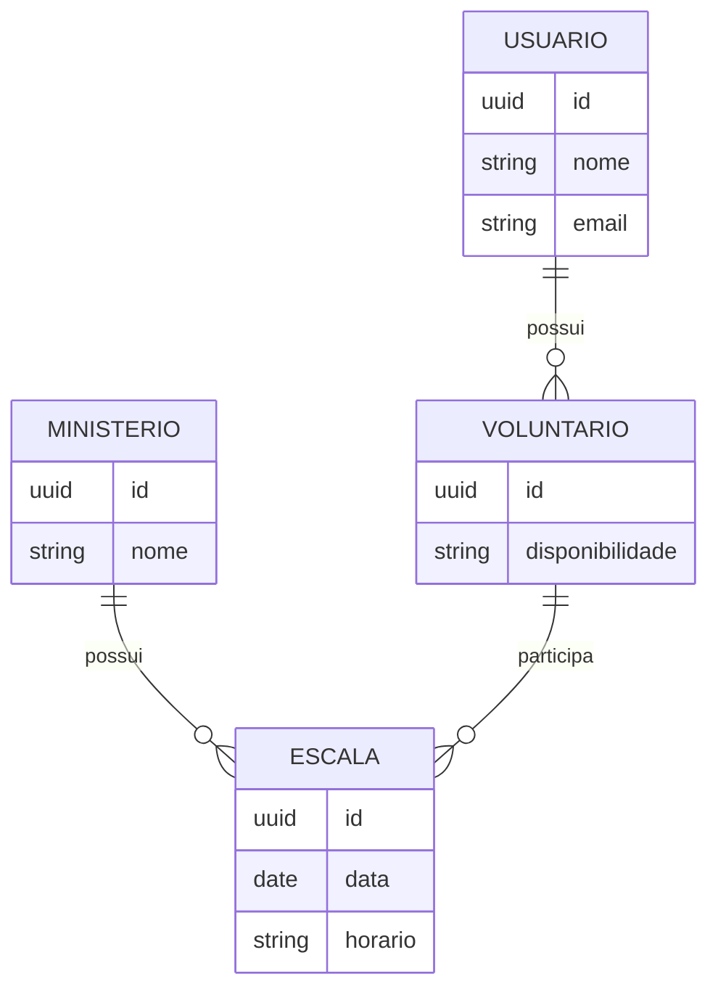
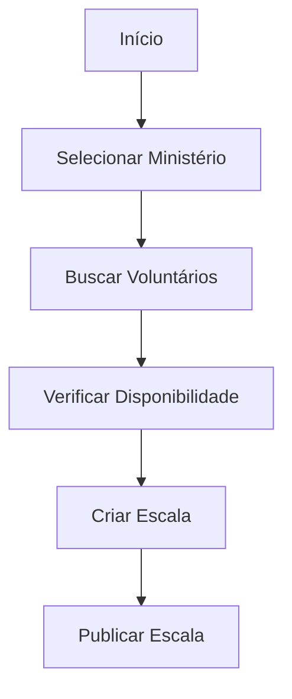

# MinistryHub 🗓️⛪

<p align="center">


</p>

<h1 align="center">MinistryHub</h1>

<p align="center">
Automação inteligente e gestão estratégica de escalas para ministérios e igrejas.
</p>

---

# 📌 Sobre o projeto

O MinistryHub é uma plataforma web desenvolvida como Trabalho de Conclusão de Curso (TCC) com o objetivo de modernizar a organização interna de igrejas e ministérios.

O projeto centraliza a comunicação entre líderes e voluntários, substituindo processos manuais, como apresentações, planilhas, imagens e mensagens dispersas, por uma solução digital intuitiva e acessível.

A plataforma foi projetada para reduzir erros humanos, agilizar a criação de escalas e facilitar o gerenciamento das equipes.

---

# 🎯 Objetivo

Criar um ambiente centralizado que permita:

- 👥 Gerenciar voluntários;
- ⛪ Organizar ministérios;
- 📅 Criar e visualizar escalas;
- 🔒 Controlar acessos dos usuários;
- ☁️ Centralizar as informações;
- 📱 Disponibilizar uma interface moderna e responsiva.

---

# ⚙️ Como funciona?

O sistema simplifica a criação das escalas através de um fluxo organizado:

1. O usuário realiza o login.
2. O sistema identifica seu perfil.
3. Os voluntários informam suas disponibilidades.
4. Os líderes organizam as escalas.
5. As informações ficam disponíveis para toda a equipe.

---

# 📐 Diagrama 1 - Arquitetura Geral



---

# 📊 Diagrama 2 - Fluxo de Utilização



---

# 🗄️ Diagrama 3 - Entidade Relacionamento



---

# 🔄 Diagrama 4 - Fluxo de Criação da Escala



---

# 🛠️ Tecnologias Utilizadas

### Frontend

- Next.js
- React
- TypeScript

### Banco de Dados

- Supabase

### Ferramentas

- Git
- GitHub
- PNPM

---

# 📂 Estrutura do Projeto

```bash
public/

src/

.gitignore

components.json

next.config.ts

package.json

pnpm-lock.yaml

pnpm-workspace.yaml

postcss.config.mjs

tsconfig.json
```

---

# 🚀 Executando o projeto

Clone o repositório:

```bash
git clone https://github.com/Guilhermbsilva/tcc2026.git
```

Entre na pasta:

```bash
cd tcc2026
```

Instale as dependências:

```bash
pnpm install
```

Execute o projeto:

```bash
pnpm dev
```

Abra no navegador:

```bash
http://localhost:3000
```

---

# 🎓 Projeto Acadêmico

Projeto desenvolvido como Trabalho de Conclusão de Curso (TCC) aplicando conceitos de:

- Engenharia de Software
- Banco de Dados
- Arquitetura de Sistemas
- Desenvolvimento Web
- UX/UI
- Computação em Nuvem

---

# 👨‍💻 Equipe

Projeto desenvolvido pela equipe do TCC 2026.

Davi Tavares

Guilherme Martins

Guilherme Barroso

Vitor Costa

Matheus Forim
